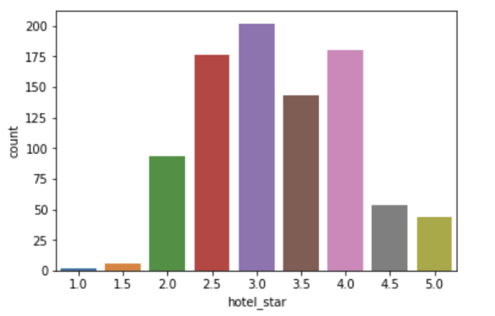

# Hotel Tier Classification
## Using Supervised Machine Learning to Classify Tiers of Hotel

### Project Objectives
- Predict Hotel Tier in New York City area
- Find out what factors affect the tier of a hotel
- Answer the question: "Is it true that the more expensive the higher the tier of a hotel?"

### Dataset
Data for 1000+ hotels in New York City from hotels.com, one of the most popluar websites for booking hotel around the world with substantial information:
- Hotel Name and Location
- Hotel Star
- Base Price
- Current Price
- User Rating
- Size of hotel
- Type of room available
- Main amenities:Fitness Center, Bar, Restaurant, Pool, Laundry Service, Valet Parking, Wifi, Electronic Device, Spa...
    
### Features and Target
10 features were engineered using the scraped data:

**Features**:
- Categorical:
  - restaurant
  - fitness center
  - bar
  - spa
  - pool
  - valet parking
  - limousine
  - rooftop
  
- Continous:
  - number of rooms
  - price

**Target**:
  - star

Some feature engineering and data cleaning: 
- Drop null values
- Turn text into binary data
- Scale continuous data

Note: I decided to have 2 sets of features with one has the price feature and the other one does not to see if there is any relationship between the price and the tier of a hotel
    
### Exploratory Data Analysis (EDA)

Initially, the hotels were divided into 10 ranks from 1 star to 5 star.

In order to balance the classes of the target, I regrouped them into 3 tiers:
- **Economy:** 1 star - 2.5 star
- **Midscale:** 3 star - 3.5 star
- **Luxury:** 4 star - 5 star

### Models
I started with 6 baseline models and used cross validation to sort out the best ones:
1. AdaBoosting: 67.99%
2. Support Vector Machine: 67.85%
3. K-Nearest Neighbor: 66.77%
4. Bernoulli Naive Bayes: 66.36%
5. Decision Tree: 57.94%
6. Random Forest: 57.48%

Then I decided to choose the top 3 and Random Forest, which has the worst performance, for hyperparameter tunning.
Ranking after hyperparameter tunning:
1. Random Forest: 
  - Accuracy: 65.9%
  - Precison: Economy 74%, Luxury 66%, Midscale 59%
  - Recal: Economy 89%, Luxury 65%, Midscale 53%
  
2. Support Vector Machine:
  - Accuracy: 65%
  - Precison: Economy 72%, Luxury 62%, Midscale 59%
  - Recal: Economy 82%, Luxury 63%, Midscale 52%
  
3. AdaBoosting:
  - Accuracy: 66.4%
  - Precison: Economy 74%, Luxury 66%, Midscale 59%
  - Recal: Economy 74%, Luxury 63%, Midscale 61%
  
4. Bernoulli Naive Bayes:
  - Accuracy: 63.3%
  - Precison: Economy 74%, Luxury 57%, Midscale 56%
  - Recal: Economy 86%, Luxury 62%, Midscale 46%
  
### Best Performing Model
I decided to choose Random Forest as the winner, and the reasons are:
- Accuracy improved from 57.5% to 65.9%. Comparing to a random guess, which is 33%, the model accuracy is twice as much.
- I wanted to minimize type I error so I picked a model with High Precision. For example, if I booked and paid for a hotel with luxurious amenities, and they give me an Economy class hotel with no pool, no spa and no clean towels. I would be so mad. 
- Recall is also high for Random Forest, but it would not be as important as Precision because I think it’s better to miss out on some hotels in the tier than to get the wrong tier for a hotel.

### "Is it true that the higher the price, the higher the tier?"
To answer this question, I plotted out the Feature Importance of the 2 sets of data, one has price feature and the other does not.

  
  
  
  
The price feature's importance is much higher comparting to the other features. Also, all the scores go up:
- Accuracy increases at least 4% for all models
- Precision increases at least 3% and at most 15% 
- Recall increases at least 3% and at most 12%

### Conclusion

I'd say that the answer for the question "Is it true that the higher the price, the higher the tier?"  is YES. Even though I have better predictive power using the features with price, I think it is common sense to see that the more expensive it is, the higher the tier of the hotel. 

Without price, the features that would affect tier of hotels are: whether a hotel has a bar, whether a hotel has valet parking, and the size of the hotel (number of rooms).

In the future, I would like to get more features to improve accuracy and precision. Also look more into location as a feature: New York vs. other cities, Urban vs. Suburban area

  
 
  
  
  

    
 
  

